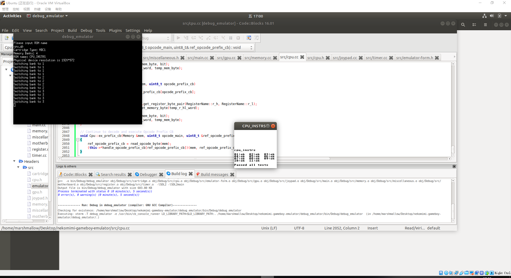
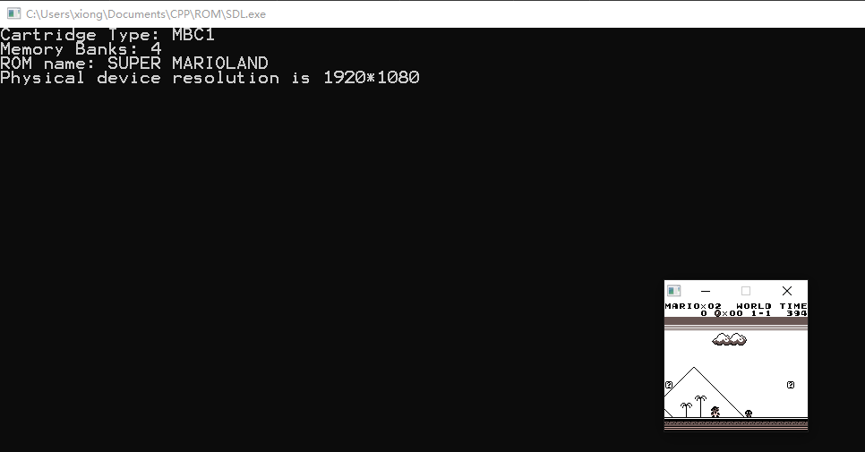

# Gameboy模拟器文档

## 项目信息

项目名：Gameboy模拟器

项目成员：熊云鹏 1850121  王新宇 1751466

贡献比例：1 : 1

项目Github地址：<https://github.com/DarkKowalski/nekomimi-gameboy-emulator/>

项目进度时间线：  

- 2019/5/20      实现寄存器，内存总线

- 2019/5/26      初步实现 CPU

- 2019/6/4       初步实现 PPU

- 2019/6/6       实现窗体，外围设备：卡带，Joypad

- 2019/6/7       实现 Timer

- 2019/6/10      实现主板

- 2019/6/14      完全实现 CPU

- 2019/6/16      调整 PPU 到可用水准

---

## 开发文档

本 **Gameboy模拟器** 由 **CPU**（中央处理单元），**Register**（寄存器），**Memory**（内存总线），**Cartridge** （卡带），**PPU**（像素处理单元），**Motherboard**（主板），**Timer**（内部时钟），**Joypad**（输入），**Form**（窗体）组成。

**CPU**模拟Gameboy中的DMG-CPU，负责解释指令，执行指令，处理中断等

**Memory**模拟Gameboy的内存总线

**Cartridge**模拟Gameboy游戏卡带的载入，提供了一种MBC模式（MBC1+ROM ONLY）

**PPU**模拟Gameboy中的像素处理单元

**Motherboard**模拟Gameboy的启动和运行过程

**Timer**模拟Gameboy的内置时钟

**Joypad**模拟Gameboy的实体按键

**Form**是模拟器的窗体，执行输出图像和处理输入的操作

本模拟器达成/实现了以下基本功能：

- 完全模拟SHARP LR35902 CPU，成功模拟所有指令集
- 实现时钟模拟
- 实现内存模拟
- 支持基本图形操作
- 支持对游戏进行交互操作（即输入）
- 支持载入ROM
- 可以基本玩一款GB游戏

和以下附加功能：

- Background Window Graphic
- Sprite

目前本模拟器已经可以运行绝大多数卡带类型为 ROM ONLY 和 MBC1+ROM ONLY 的游戏，如

- Super Marioland
- Tetris（俄罗斯方块）
- Battlecity（坦克大战）
- PaperBoy

 等游戏。

有部分使用 MBC1 + RAM (+ BATTERY) 的游戏也可以运行，如

- Box（推箱子）
- Zelda（塞尔达）

目前该模拟器可以在Windows平台和Linux下使用，Mac平台可自行编译运行

### 编译为可执行文件

Windows:

> mingw32-g++.exe -Wall -march=corei7-avx -fomit-frame-pointer -fexpensive-optimizations -Wall -std=c++14 -I < SDL2 headers > -C < source > -o < objects out >
>
> mingw32-g++.exe -L < SDL2 libs > -o < out executble > < objects out >  -lmingw32 -lSDL2main -lSDL2 -O3

Linux:  Just run build.sh and run.sh
